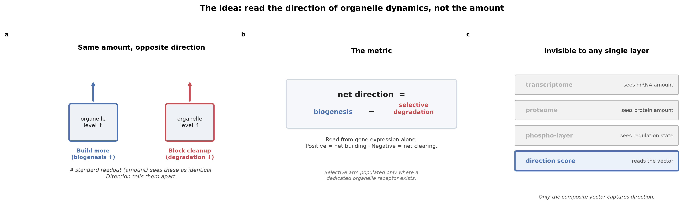

<div align="center">

# Organelle Direction

### Same amount. Opposite fate.

**Two cells can hold the same number of mitochondria for opposite reasons — one is building them,
the other has stopped clearing them. Count how many are there and they look identical.
Read the *direction* instead, and you can predict which cancers are addicted to their mitochondria,
and which drugs will hit them.**

[**▶ Open the interactive demo**](https://different-change.github.io/organelle-direction/) ·
[**Read the report**](https://different-change.github.io/organelle-direction/report/report.html) ·
[**Full technical record**](https://different-change.github.io/organelle-direction/report/full_technical_report.html)

[](LICENSE)
[](LICENSE)
[](#how-claude-science-was-used)
[](#data-sources-all-public)

</div>

---

## The one idea

A standard organelle signature answers *how much is there*. But build-up and tear-down move many of the
same genes, so a single-axis score cannot tell a cell that is proliferating mitochondria from one whose
disposal machinery has stalled. To the cell those are opposite states. Worse, the genes that *would*
separate them — the selective-autophagy receptors — are usually not in a conventional organelle
signature at all.

So we score the two opposing programs separately and subtract them:

```
net_direction  =  biogenesis  −  selective degradation
```

One signed number per sample, read from ordinary transcriptomes, proteomes, or phosphoproteomes.
Positive means net building; negative means net clearing.

It is a **set-point** — which program dominates *now* — validated against timecourses where the true
direction is known. It is **not** an organelle headcount, and **not** a measured turnover rate.

<div align="center">

</div>

---

## What direction buys you

| Result | Number | Data |
|---|---|---|
| **Direction → genetic vulnerability** | ρ = −0.35, p = 1.7×10⁻³², n = 1,066 cell lines | DepMap CRISPR |
| ↳ survives dependency-burden control | partial r = −0.32 | |
| ↳ lineage-robust | negative in 17/18 lineages | |
| ↳ mitochondria-specific | mito→mito −0.35 vs mito→ribosome −0.07 | |
| **Direction → drug response** | IACS-010759 at 3rd percentile of 1,514 drugs; MitoQ #1 | DepMap PRISM |
| ↳ survives a proliferation confound | mito-drug class MWU p = 0.017 | |
| **Direction beats amount** | AUROC 0.666 (direction) vs 0.613 (raw expression) | same vulnerability endpoint |
| **Generalizes, graded by organelle** | mito −0.35 / ER −0.15 (survives controls) / lysosome null | DepMap |
| **Cross-modal agreement in human tumour** | mito-biogenesis RNA g = −1.52 · protein g = −3.14 | CPTAC ccRCC |

Nothing told the score what those drugs or genes do. It ranked them from organelle biology alone.

Effect sizes are modest (ρ 0.15–0.35; AUROC 0.60–0.67) — as expected for a single-pathway expression
score predicting a functional phenotype across highly heterogeneous cell lines. The value is a **real,
specific, lineage-robust, correctly-signed** signal, not a high-accuracy point predictor.

---

## Things we tried to break first

Every headline above survived an adversarial check. The ones that didn't survive are reported too —
that is the point.

- **Reported a null at power.** A weak survival hint in CPTAC kidney cancer (Cox p = 0.04, 21 deaths)
  did **not** replicate when retested at 8× the power in TCGA-KIRC (508 tumours, 168 deaths;
  Cox p = 0.21, log-rank p = 0.65). The flat survival curves are in the report; positive controls
  (stage HR = 1.93, p = 5.6×10⁻²¹) confirm the pipeline works.
- **Recorded its predictions up front.** Nine directional predictions were written down and
  SHA-256-hashed at the start of the validation work ([`data/PREREGISTRATION.md`](data/PREREGISTRATION.md)).
  4/9 hit — including a high-confidence **miss** (COAD) that was recorded and reported as a miss, which is
  what makes the hits credible rather than fitted. The hash proves the prediction file was never edited
  afterward; it cannot by itself prove ordering, since no external timestamp was anchored during the
  hackathon. Read it as a documented commitment, not cryptographic pre-registration.
- **Refuted its own headline.** A striking r = 0.88 organelle "coupling" was flagged as a
  shared-timecourse artefact and re-led with the mechanism that survived (TFEB-dependence).
- **Walked back a replication claim.** A second drug platform (GDSC) looked like independent
  replication; the confound test showed it was mostly a general drug-sensitivity axis, so it was
  downgraded to "weak directional consistency." PRISM survives the same test; GDSC does not.
- **Demoted its own statistic.** Swapped an over-generous equal-variance test (p = 0.0005) for the
  correct Welch test (p = 0.0094) — kept the weaker, right number.

---

## Run it on your own data

Requires Python ≥ 3.9 with `pandas` and `numpy`.

```bash
git clone https://github.com/different-change/organelle-direction
cd organelle-direction/scorer

# 1. confirm every shipped gene module loads
python run_dynamics.py --self-check

# 2. score your own matrix (genes × samples, gene IDs in the first column)
python run_dynamics.py --expression your_matrix.csv \
    --organelle mitochondrion --organism human --out scores.csv
```

`--self-check` prints the full module grid:

```
organelle     species      biogenesis  degradation  selective
-------------------------------------------------------------
mitochondrion human                83           20          6
lysosome      human                79           29          6
er            human                73           25          7
peroxisome    yeast                30           20          1
...                                                     (16 modules)
```

Or use it as a library:

```python
from score_organelle_dynamics import score_organelle_dynamics
from run_dynamics import load_module

bio, deg, sel = load_module("human", "mitochondrion")
scores = score_organelle_dynamics(expr, bio, deg,
                                  degradation_selective_ids=sel,
                                  method="rank", n_perm=1000)
scores[["biogenesis_score", "degradation_score", "net_direction"]]
```

The score is `rank_pct(biogenesis genes).mean − rank_pct(selective-clearance genes).mean` per sample,
with an empirical permutation null. `method="rank"` works on a **single sample** — no cohort required.

### The 16 shipped modules

Seven organelles across four species, every gene resolver-backed with provenance in
[`data/genesets/`](data/genesets/):

| | yeast | *Arabidopsis* | rice | human |
|---|:---:|:---:|:---:|:---:|
| peroxisome | ✅ selective | ⬜ no receptor | ⬜ no receptor | |
| mitochondrion | ✅ selective | ⬜ no receptor | ⬜ no receptor | ✅ **selective** |
| ER | ✅ selective | ⬜ no receptor | ⬜ no receptor | ✅ selective |
| chloroplast | | ⬜ effectively empty | ⬜ no receptor | |
| lysosome | | | | ✅ selective |
| lipid droplet | | | | ⬜ no receptor |
| ferritin / iron | | | | 🔶 partial |

The clearance arm is populated **wherever a genuine selective-autophagy receptor exists** (yeast Atg36,
Atg32/33, Atg39/40; human PINK1/Parkin/NIX/BNIP3/FUNDC1, the lysophagy galectins, the FAM134B ER-phagy
family) and **empty where none is known** — every plant organelle, and the human lipid droplet, where
lipophagy is bulk autophagy with no LD-selective receptor. That pattern is biology, not a scorer defect,
and the tool reports it instead of hiding it. Details and the honest partials in
[`scorer/README.md`](scorer/README.md).

The engine is organelle- and trait-agnostic: drop in a new pair of gene-set CSVs with the same columns
and it scores that instead.

---

## Repository layout

```
index.html                     ← landing page (published via GitHub Pages)
demo/index.html                ← interactive walkthrough; press P for Presenter Mode
report/
  report.html                  ← the judging document: 7-beat spine, standalone-readable figures
  full_technical_report.html   ← complete technical record (35 figures, all analyses)
figures/                       ← the six 300-DPI figures, each readable cold
scorer/
  score_organelle_dynamics.py  ← the organelle-agnostic scoring engine (pure function, permutation null)
  run_dynamics.py              ← module loader + command-line interface
  README.md                    ← method, module grid, validation, honest limits
data/
  genesets/                    ← 16 curated biogenesis / selective-clearance modules + provenance
  scores/                      ← the result tables behind every figure
  prospective_predictions.*    ← the hash-locked blind predictions
  PREREGISTRATION.md           ← human-readable pre-registration record
```

---

## Honest limits

- **mRNA is a proxy, not an organelle count.** Read a score as "consistent with a shift toward
  biogenesis / clearance," never as a turnover rate. Corroborate against proteome or imaging where possible.
- **The biogenesis arm is high-confidence** (conserved machinery, clean signal); **the clearance arm is
  weaker**, and in plants it is bulk-autophagy-confounded by construction.
- **Ferritin's clearance arm is not mRNA-validatable** — NCOA4 is controlled post-translationally, so its
  transcript stays flat even when ferritinophagy fires. Reported as a partial, not a result.
- **Cross-taxa rule:** machinery conserves, regulators diverge. Only conserved machinery was mapped by
  orthology; lineage-specific regulators were dropped.
- **Kidney-cancer survival is a null**, at power. It is in the report as prominently as the wins.

---

## Data sources (all public)

DepMap 24Q2 (expression, CRISPR gene-effect, PRISM drug response) · TCGA-KIRC (cBioPortal) ·
CPTAC ccRCC (RNA, protein, phosphoproteome) · MoTrPAC · AtGenExpress · NCBI GEO series
(accessions in the technical report).

No proprietary or unpublished data is used anywhere in this repository.

---

## How Claude Science was used

The entire pipeline — gene-set curation, the scoring engine, every confound control, all figures, both
reports, and the adversarial self-refereeing above — was built in **Claude Science**, with a scientist
in the loop at every decision.

That last clause is the load-bearing one. The rigour is reproducible by anyone with the same tools; what
is not is the biology judgment that shaped the method — splitting biogenesis from clearance in the first
place, and knowing that the selective arm should only be populated where a real receptor exists. The
tool works precisely where domain knowledge was injected, and returns honest emptiness where it wasn't.

---

## Provenance

Built for **Built with Claude: Life Sciences** (Anthropic × Cerebral Valley × Gladstone Institutes),
Research track, 7–13 July 2026.

The method operationalises the *organellomics* framework — organelle abundance and turnover as a readout
of cellular stress resilience:

> Hickey K, **Nazarov T**, Smertenko A. (2023) Organellomic gradients in the fourth dimension.
> *Plant Physiology* 193(1):98–111. <https://academic.oup.com/plphys/article/193/1/98/7181000>

## Citation

If you use the code, the gene modules, or the results, cite via [`CITATION.cff`](CITATION.cff) —
GitHub's "Cite this repository" button will format it for you.

## License

Code is [MIT](LICENSE). Gene modules, result tables, figures and reports are CC BY 4.0.
Underlying primary data remain under their original providers' terms.
